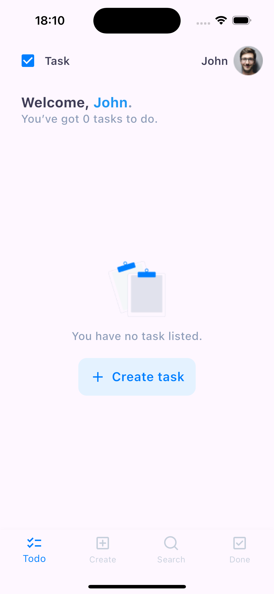
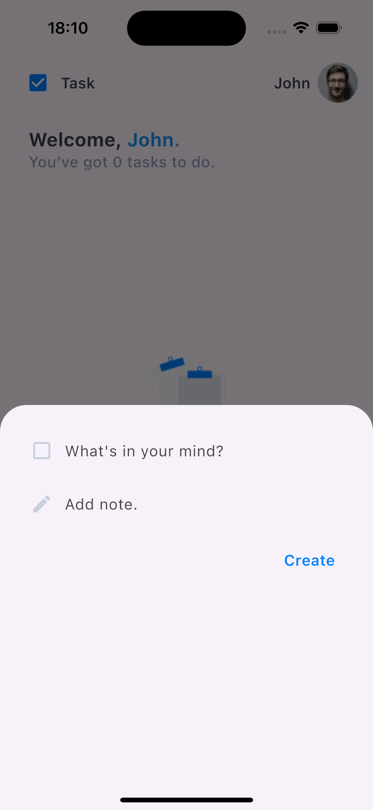
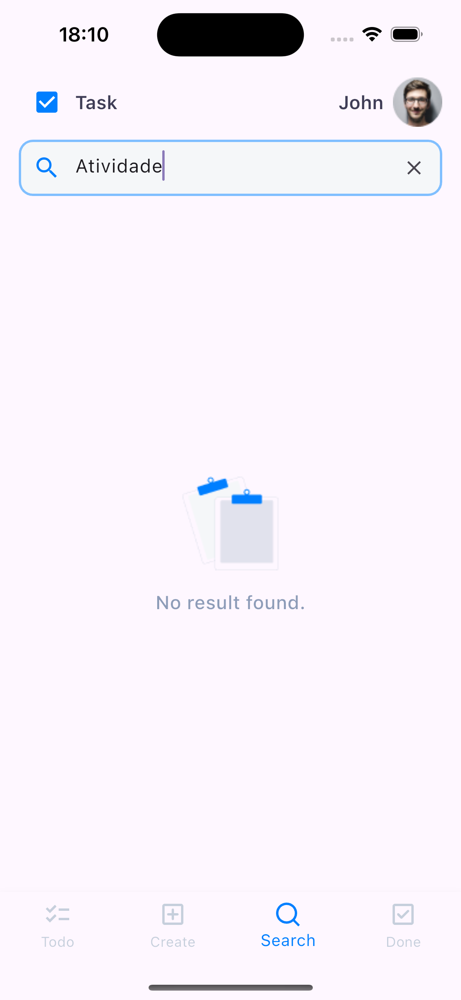
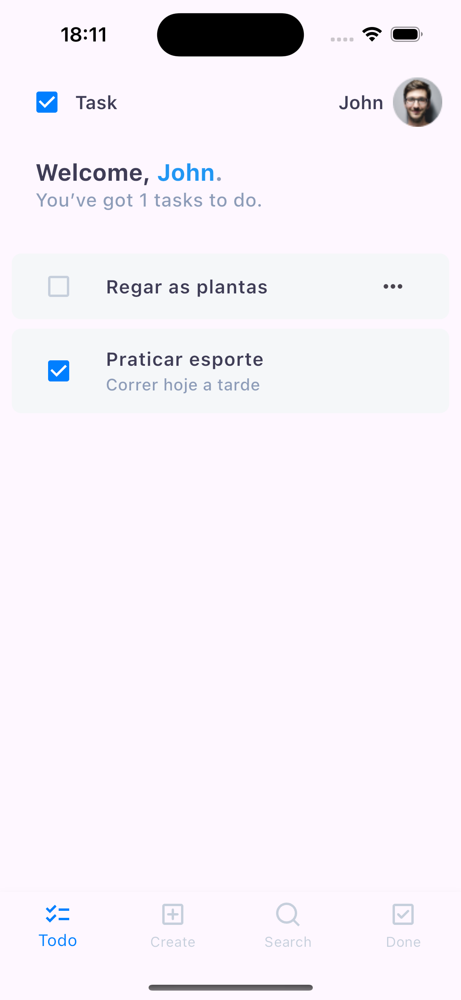
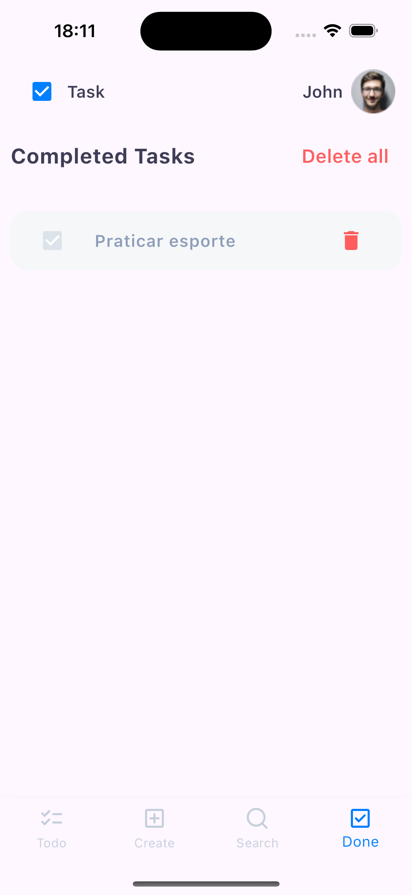

# Todo List Flutter

Este é um projeto desenvolvido com Flutter 3.27.1. Siga as etapas abaixo para configurar e executar o projeto em sua máquina.

---

## Resultado

<p align="center">
  
  
  
  
  
</p>

---

## Pré-requisitos

Antes de começar, certifique-se de ter os seguintes itens instalados:

1. **Flutter 3.27.1**  
   Instale o Flutter seguindo as instruções oficiais: [Instalação do Flutter](https://docs.flutter.dev/get-started/install)

2. **Dart SDK** (incluído na instalação do Flutter)

3. **Android Studio** (com o plugin Flutter configurado) ou outro editor de sua preferência, como Visual Studio Code.

4. **Emulador ou Dispositivo Físico** para testar o aplicativo.

5. **Git** (opcional, mas recomendado para clonar o repositório).

---

## Passo a passo

### 1. Clone o Repositório

```bash
git clone https://github.com/WelvisSS/todoList.git
cd todolist
```

### 2. Verifique a Versão do Flutter

Certifique-se de que está utilizando a versão correta do Flutter:

```bash
flutter --version
```
Deve exibir `Flutter 3.27.1`.

### 3. Instale as Dependências

No diretório do projeto, execute:

```bash
flutter pub get
```


### 5. Execute o Projeto

Inicie o projeto com o comando:

```bash
flutter run
```


## Testes

Execute os testes automatizados com o comando:

```bash
flutter test
```

---
